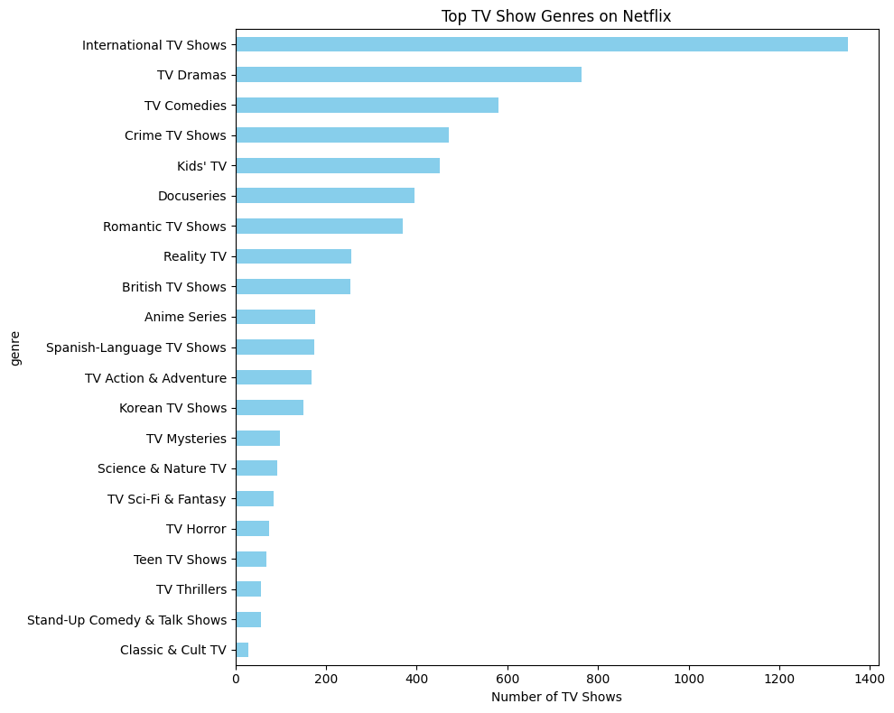
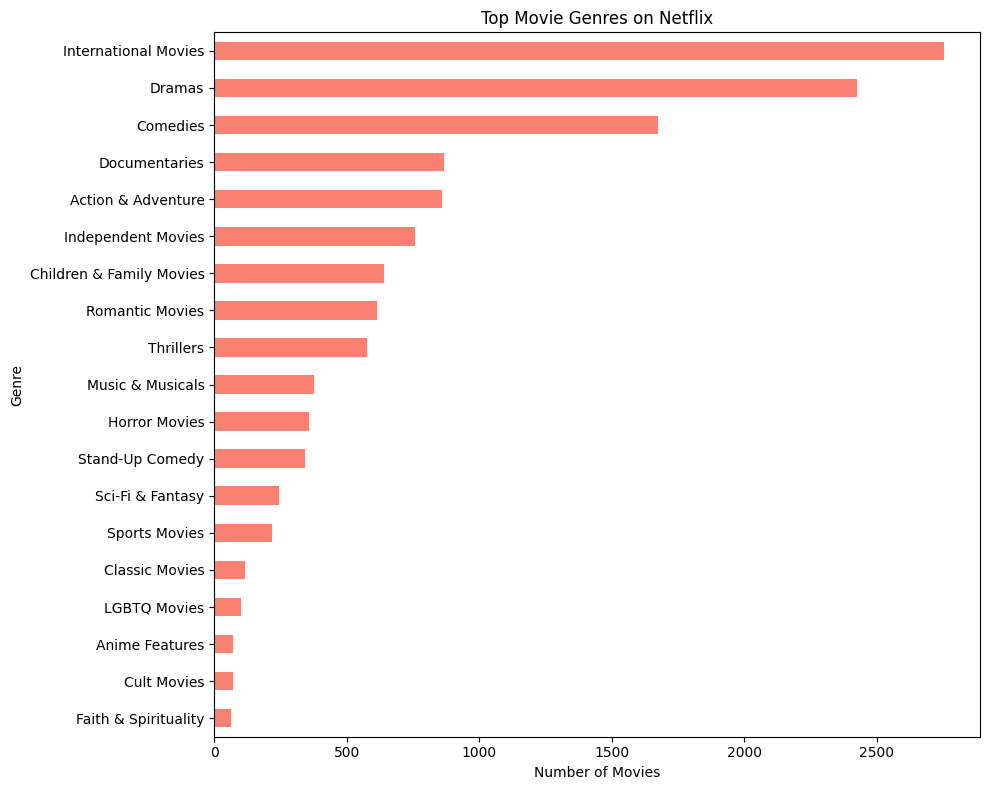
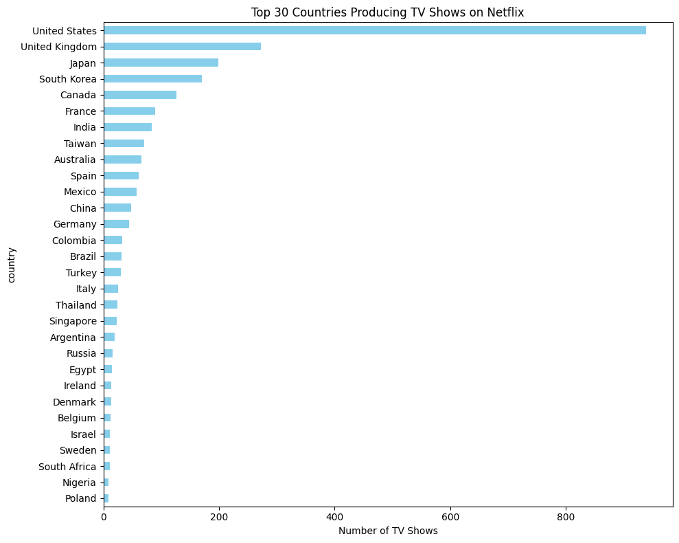
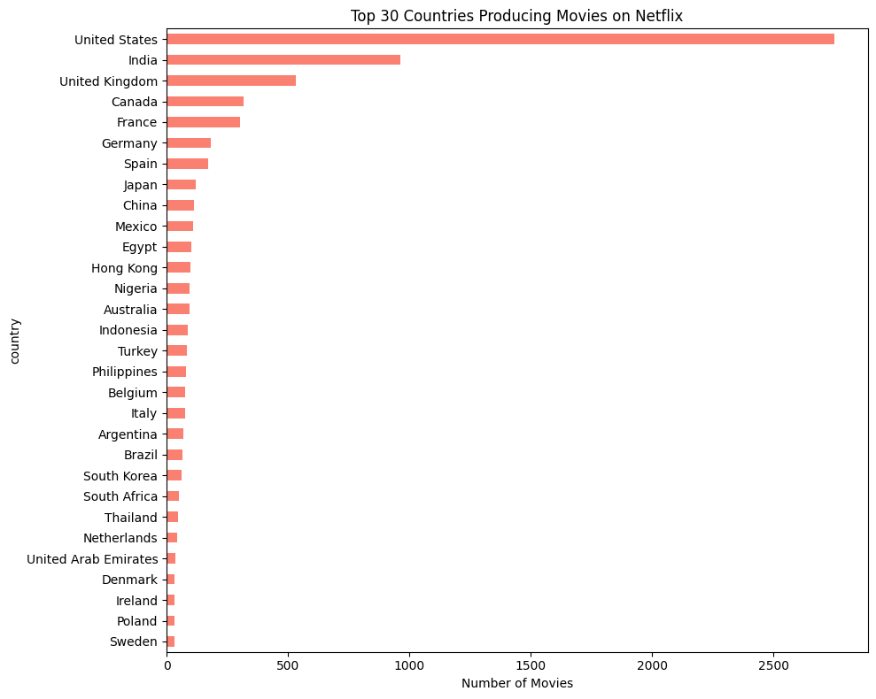
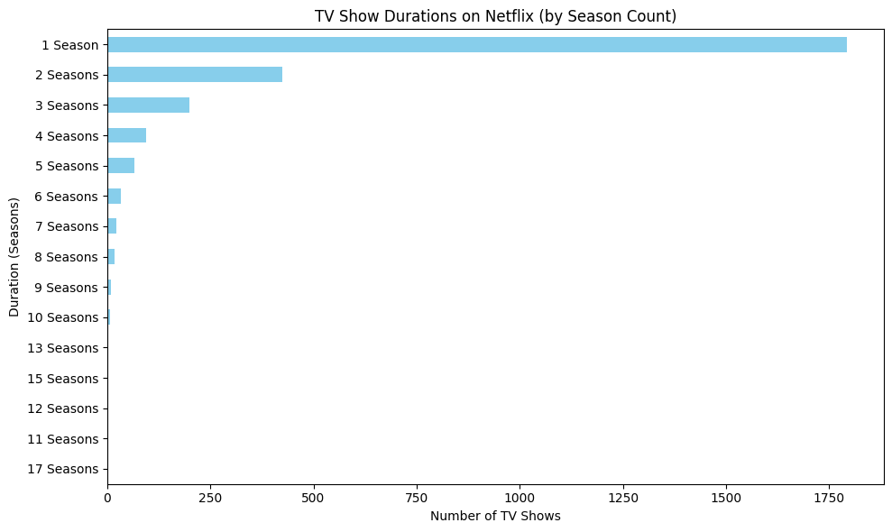

### ✅ **Dataset Overview**

- **Rows**: 8807

- **Columns**: 12

- No duplicate rows found.

### 🧾 **Columns Summary**

| Column         | Non-null Count | Missing | Notes                   |
| -------------- | -------------- | ------- | ----------------------- |
| `show_id`      | 8807           | 0       | Unique ID for each show |
| `type`         | 8807           | 0       | Movie or TV Show        |
| `title`        | 8807           | 0       | Show title              |
| `director`     | 6173           | 2634    | Many missing values     |
| `cast`         | 7982           | 825     | Partial missing data    |
| `country`      | 7976           | 831     | Partial missing data    |
| `date_added`   | 8797           | 10      | Minor missing           |
| `release_year` | 8807           | 0       | Fully present           |
| `rating`       | 8803           | 4       | Nearly complete         |
| `duration`     | 8804           | 3       | Almost complete         |
| `listed_in`    | 8807           | 0       | Fully present           |
| `description`  | 8807           | 0       | Fully present           |

---

### 📊 **Highlights from `describe(include='all')`:**

- **`type`**: Two categories — *Movie* and *TV Show*. Movies dominate (freq: 6131) and TV Show (freq: 2676).

- **`release_year`**: Ranges from **1925** to **2021**, mean year ~2014.

- **`rating`**: Top rating is `TV-MA`, indicating mature content dominates.

- **`listed_in`**: Most common genre tag is *Dramas, International Movies*.

---

### ⚠️ **Missing Data Insights**

- High missingness in:
  
  - `director`: ~30%
  
  - `cast`, `country`: ~9–10%

- Very minor issues with `rating`, `duration`, `date_added`.

### 🧭 **Release Year Analysis**

#### 📅 Overall Range

- **Earliest**: 1925

- **Latest**: 2021

- **Range**: 96 years

- **Unique Years**: 74

- **Most Common Year**: ⭐ **2018**

#### 🎯 Top 5 Most Frequent Release Years (All Titles)

| Year | Titles Released |
| ---- | --------------- |
| 2018 | 1147            |
| 2017 | 1032            |
| 2019 | 1030            |
| 2020 | 953             |
| 2016 | 902             |

---

### 📺 **TV Shows: Top 5 Release Years**

| Year | Count |
| ---- | ----- |
| 2017 | 265   |
| 2018 | 380   |
| 2019 | 397   |
| 2020 | 436   |
| 2021 | 315   |

### 🎬 **Movies: Top 5 Release Years**

| Year | Count |
| ---- | ----- |
| 2016 | 658   |
| 2017 | 767   |
| 2018 | 767   |
| 2019 | 633   |
| 2020 | 517   |

**Observation**: There's a noticeable decrease in Netflix content releases around the years that COVID started. 

---

### 🎭 **TV Show and Movie Genre Analysis**

You identified **22 unique genres**. Here's a quick look at the **top 10**:

🧠 **Insight**: Netflix has a strong focus on **international content** and **drama/comedy-based series and movies**, aligning with global viewership trends.

---

### Countries contribution in Netflix TV Shows and Movies

US is top leading producer in both TV Shows and movies. 

---

It can be seen that most of TV Show have ended in **1st season**.

### Genre frequency by TV Shows and Movies rating

TV Mature Adults (TV-MA) is the major rating for most of the genres. Second to that is TV-14.

---

### Genre frequency by TV Shows and Movies origin country

